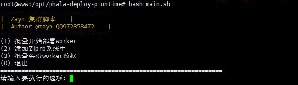

## phala-batch-deploy-pruntime

## 项目介绍
`phala-batch-deploy-pruntime`是由纯shell编写的脚本

## 设计实现
主要通过`expect`实现免密登录，进而操控所有worker机器实现批量环境部署，通过这种方式不需要在`worker`机器上安装任何软件和工具，只需要保证机器系统都是`Ubuntu20`，并且都是干净的环境，且都是相同的账号密码登录即可。

## 使用步骤
1. 克隆项目到本地
```shell
git clone git@github.com:zayn-code/phala-batch-deploy-pruntime.git
```
2. 进入目录，配置main.sh 里的config参数（参数都有注释）
```shell
cd phala-batch-deploy-pruntime
vim main.sh
```
3. 执行main.sh
```shell
bash main.sh
```
执行成功后会出现交互界面 根据提示选择自己要执行操作的序号即可。如下图



### 如果该项目对您有所帮助，希望您动动小手点个star